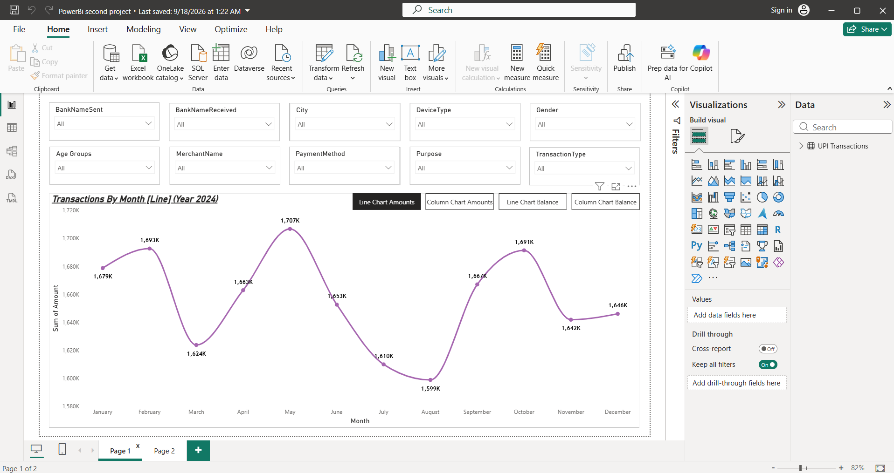
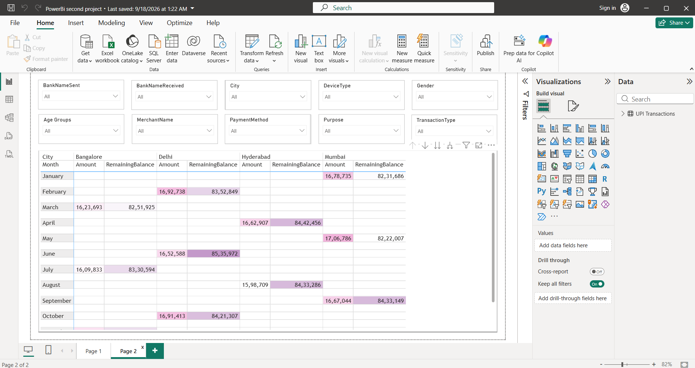

# UPI Transaction Data Analysis Dashboard | Power BI

## Project Overview

Developed an interactive Power BI dashboard to analyze 20,000 UPI transactions and identify transaction trends and payment patterns.

## Key Analysis

- Monthly transaction trends
- City-wise analysis
- Bank-wise analysis
- Transaction amount and remaining balance
- Device type analysis
- Age group and gender analysis
- Payment method and purpose analysis
- Transaction type analysis

## Power BI Features

- Line Charts
- Column Charts
- Matrix/Table
- Slicers
- Bookmarks
- Interactive filtering

## Dashboard Screenshots

### Transaction Trends

### City & Month Analysis

## Project Files

- `UPI Transaction PowerBi Project.pbix` — Power BI dashboard file
- Dashboard screenshots
- Project documentation
